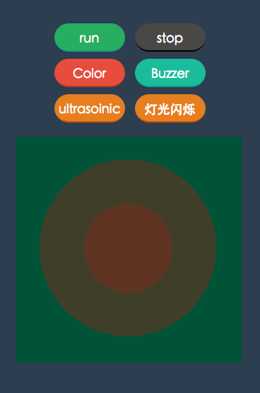

# motionX
motionX is a experiment project. It includes mbot control panel and camera action detect.

In mbot

# To Start

    npm install & npm start

And then, open `mbot.html` to use mbot online control panel.
You should put the project into a server environment(to be imporved).

# Description of files

- **mbot.html** mbot online control panel
- **index.html** camera motion detect control panel.

# Resource
- [mbot protocol guide](http://learn.makeblock.com/makeblock-orion-protocol/)

# Change log
【20151009 v0.1.0】
>1. feat: init project and add mbot online control panel.
